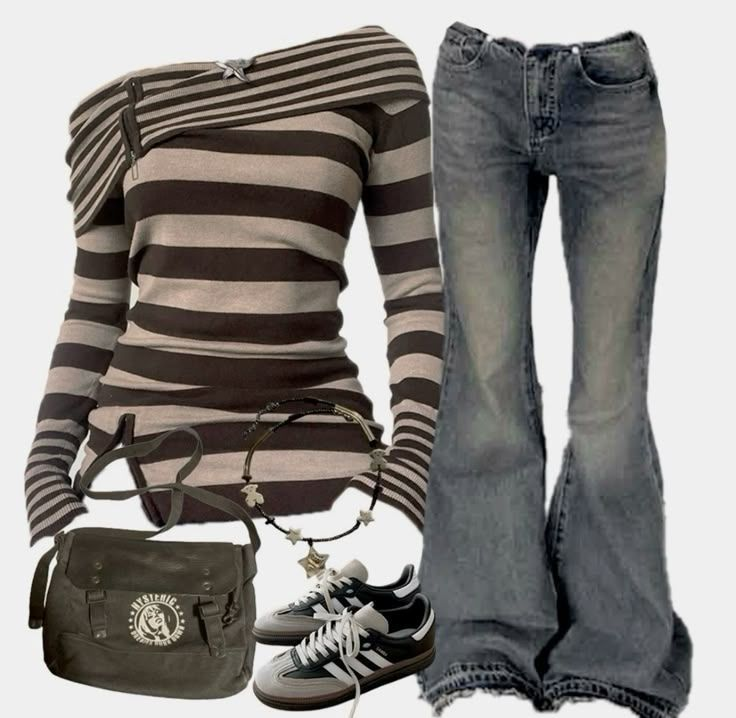
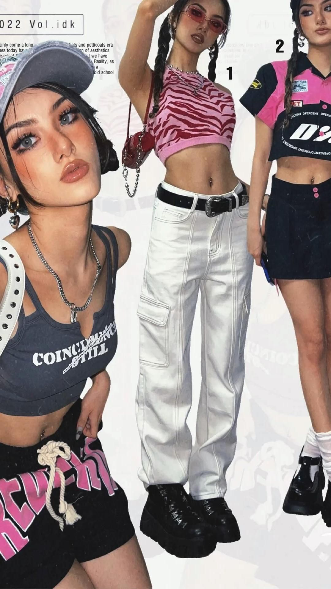
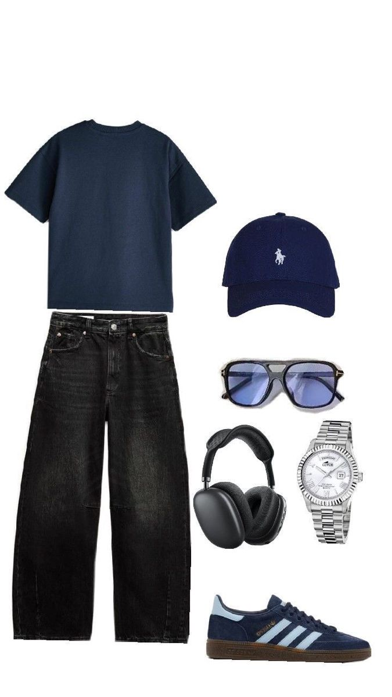
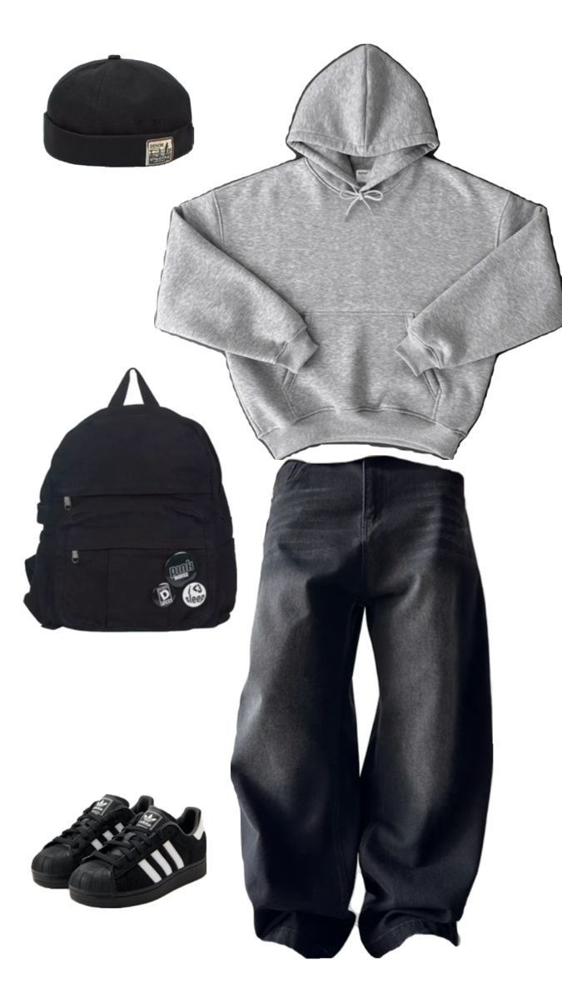

# Clothing Style Classification: Y2K vs Minimalism

## Задача
Создать простую модель, которая классифицирует изображения одежды по стилю на основе собранных референсов.

В качестве основного стиля был выбран **Y2K**, в качестве контрастного — **Minimalism**.

---

## Сбор датасета

Данные собирались вручную из **Pinterest**.

### Используемые стили
- **Y2K (основной стиль)** — 33 изображения
- **Minimalism (контрастный стиль)** — 33 изображения

Изображения подбирались по запросам:
- *Y2K reference*
- *Minimalism reference*

### Примеры референсов
- Y2K: укороченные топы, яркие цвета, низкая посадка, аксессуары, глянец  

- Minimalism: нейтральные цвета, простые силуэты, минимум деталей

---

## Мини-анализ стилей

Стиль **Y2K** характеризуется яркой и насыщенной цветовой палитрой, смелыми силуэтами, укороченной одеждой, принтами и большим количеством аксессуаров. Часто используются глянцевые материалы, джинса с низкой посадкой и акцент на фигуру.  
**Minimalism**, напротив, строится на сдержанных цветах (белый, чёрный, бежевый, серый), простых формах и чистых линиях. Одежда минималистична по деталям и обычно выполнена из матовых, однотонных тканей.

Для классификации модель может использовать такие признаки, как:
- цветовая гамма (яркая vs нейтральная),
- сложность силуэта,
- количество деталей и аксессуаров,
- текстуры и материалы.

---

## Подготовка данных

- Все изображения были приведены к одному размеру
- Использовалась нормализация
- Данные были разделены на:
  - train
  - validation
  - test

Из-за небольшого объёма датасета использовались базовые приёмы регуляризации.

---

## Выбор модели

В качестве основной модели была выбрана **ResNet18**.

### Почему ResNet18:
- простая и хорошо изученная архитектура,
- подходит для небольших датасетов,
- содержит residual-соединения, которые упрощают обучение,
- быстрее обучается по сравнению с более глубокими моделями.

---

## Параметры обучения

- **Batch size:** 8  
  (выбран из-за малого количества данных)
- **Learning rate:** 1e-4  
- **Количество эпох:** 30  
- **Оптимизатор:** AdamW

Итоговая модель выбиралась по **минимальному loss на validation**.

---

## Результаты

Результаты обучения и тестирования сохранены в виде изображений:

## Результаты Train
- Accuracy : 0.913
- Precision: 0.913
- Recall   : 0.9259
- F1-score : 0.9124

**Отчёт по классам**
| Класс     | Precision | Recall | F1-score | Support |
|----------|-----------|--------|----------|---------|
| Contrast | 1.00      | 0.85   | 0.92     | 27      |
| Y2K      | 0.83      | 1.00   | 0.90     | 19      |

## Результаты Valid
- Accuracy : 0.9
- Precision: 0.9
- Recall   : 0.9167
- F1-score : 0.899

**Отчёт по классам**

| Класс     | Precision | Recall | F1-score | Support |
|----------|-----------|--------|----------|---------|
| Contrast | 1.00      | 0.83   | 0.91     | 6       |
| Y2K      | 0.80      | 1.00   | 0.89     | 4       |

Видно, что модель сделала ошибку только на фотографии, где есть некая схожесть с минимализмом - спокойные тона, отсутствие силуэтов

## Результаты Test
- Accuracy : 0.8
- Precision: 0.8
- Recall   : 0.8571
- F1-score : 0.7917

**Отчёт по классам**

| Класс     | Precision | Recall | F1-score | Support |
|----------|-----------|--------|----------|---------|
| Contrast | 1.00      | 0.71   | 0.83     | 7       |
| Y2K      | 0.60      | 1.00   | 0.75     | 3       |

Модель показывает смешанную точность разделения классов на тесте, однако видно, что на фотографиях где был неверный предикт ее уверенность сильно отличается, от тех, что были размечены правильно.

- Средняя уверенность в предсказании на Valid: 0.83
- Средняя уверенность в предсказании на Test: 0.87

---

## Эксперименты и улучшения

Что было протестировано:
- **MixUp** и **CutMix** — не дали улучшения, модель недообучалась
- **Dropout** — показал себя хорошо и помог снизить переобучение модели, возможно стоило выбрать такой, который давал бы средний результат на валиде, чтобы модель получилось еще более сбалансированной.

Что можно улучшить в будущем:
- собрать больше данных,
- использовать более разнообразные аугментации,
- попробовать другие архитектуры,
- более аккуратно формировать validation и test выборки.

---